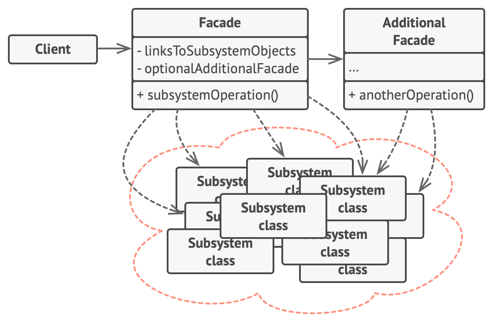

# Smart Home Facade (Python)

## Описание проекта

В данном проекте реализована упрощённая система "умного дома" с использованием паттерна проектирования **Фасад (Facade)**.

Система состоит из нескольких подсистем:
- освещение (LightSystem)
- температура (TemperatureSystem)
- музыка (MusicSystem)
- будильник (AlarmSystem)

Для упрощения взаимодействия с ними реализован класс `SmartHomeFacade`, который предоставляет единый интерфейс для управления системой.

---

## Используемый паттерн

**Facade (Фасад)** — структурный паттерн, который предоставляет простой интерфейс к сложной системе классов.

В данном проекте:
- подсистемы выполняют конкретные задачи
- фасад объединяет их и предоставляет готовые сценарии

---

## Структура проекта

```
.
├── README.md
├── facade.py
├── main.py
└── systems.py
```


---

## Подсистемы

### MusicSystem
- воспроизведение музыки
- настройка громкости
- установка таймера

### LightSystem
- включение/выключение света

### TemperatureSystem
- установка температуры

### AlarmSystem
- установка будильника

---

## Фасад

Класс `SmartHomeFacade` скрывает сложность работы с подсистемами и предоставляет простой метод:

### sleep_mode()

Сценарий "режим сна":
- выключает свет
- устанавливает температуру (20°C)
- включает спокойную музыку
- устанавливает громкость
- включает таймер на 30 минут
- ставит будильник

---

## Пример использования

```python
from facade import SmartHomeFacade

home = SmartHomeFacade()

for action in home.sleep_mode():
    print(action)
```

## Пример вывода
```
Свет выключен
Установлена громкость 3
Играет жанр calm
Музыка включена и остановиться через 20 минут
Установлена температура 20 градусов
Установлен будильник на 06:00 часов
```
